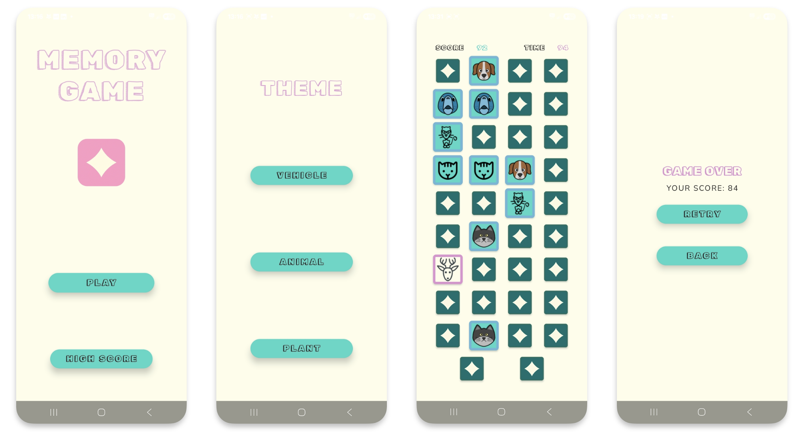
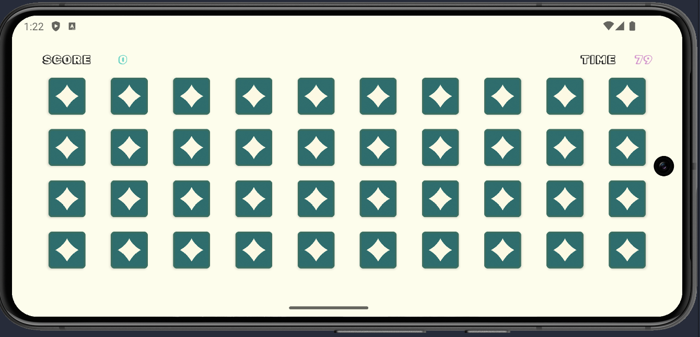

### Memory Game Portfolio App.

#### `A MemoryGame`  with the purpose to display use of the following:

* ##### Kotlin Multiplatform with shared UI in Jetpack Compose.
* ##### MVVM architecture.
* ##### Kotlin, Jetpack Compose and Swift/SwiftUI where it will be needed. 
* ##### Icon fetches from REST-API via my own proxy server for deploy. 
* ##### Git workflow.
* ##### Documentation in Code / README.
* ##### Game logic, design and responsive UI.

