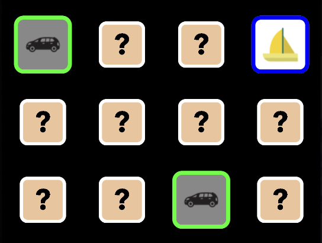

### Memory Game Portfolio App.

#### `A MemoryGame`  with the purpose to display use of the following:

* ##### Kotlin Multiplatform with shared UI in Jetpack Compose.
* ##### MVVM architecture.
* ##### Kotlin, Jetpack Compose and Swift/SwiftUI where it will be needed. 
* ##### Async icon fetches from REST-API via my own proxy server for deploy. 
* ##### Git workflow.
* ##### Documentation in Code / README.
* ##### Game logic, design and responsive UI.
* ##### Unit testing when time is given.


#### Progress of the game
<details>
<summary>Branches and Progress</summary><br>

###### Currently working on: `feature/ui-improvements`

:white_check_mark: `feature/tile-component`. Is focused on creating a component for the tile and at click, the tile
should change it's state and show the content. It will also involve an animation when changing state.

:white_check_mark: `feature/ui-board`. Will be a simple board implementing a list of tile components.
Also, since I will be using MVVM, an early structure must be formed.

:white_check_mark: `feature/icons-from-api`. This feature is fetching a response from IconFinder 
with 10 icons of a certain keyword. The request is made to a render-url using a proxy server 
for this simple purpose. The proxy server has been a side-project to the game to handle API security.

<details>
<summary>Preview code snippet</summary>

```kotlin
// Extensions in Application.
import io.ktor.server.application.*

fun main(args: Array<String>) {
    io.ktor.server.netty.EngineMain.main(args)
}

fun Application.module() {
    configureRateLimit()
    configureSerialization()
    configureHTTP()
}
````

</details>

:white_check_mark: `feature/load-tiles-from-start-screen` Since we have a JSON-response from the proxy server,
handle the response and set the tile images. The render service is using a free version with longer 
activation time, therefore, show the user a start screen loading the service and response.

<details>
<summary>Preview image</summary>


</details>

:white_check_mark: `feature/compare-tiles-and-match` Compare the tiles. If they match, change
their state and appearance.

<details>
<summary>Preview image</summary>



</details>

:white_check_mark: `feature/score-from-timer-gameplay` Start the game with a timer and let
the score be based on how fast you solve the entire board. Finish the gameplay with
a few extra touches (animation and new backside).

<details>
<summary>Preview gameplay (10 fps gif)</summary>


</details>

:white_check_mark: `feature/sound-implementation` Play background music during gameplay and sound effects
when tiles match and when they don't.

:white_check_mark: `feature/start-screen-design` Make the start screen more visually appealing. Create
a global stylesheet. Also make the UI screen more responsive with tile sizes.

:construction: `feature/ui-improvements` Create an Error-popup for features that won't be ready with first release.
Also use this to reload fetch if it is incomplete. Inform the user to turn of energy save mode. 
Add a score animation to finish gameplay if time is given.

:warning:
##### Known Issues

- 2025-08-15
Very subtle race conditions when flipping tiles in a fast pace. Will work on this after deploy.


</details>