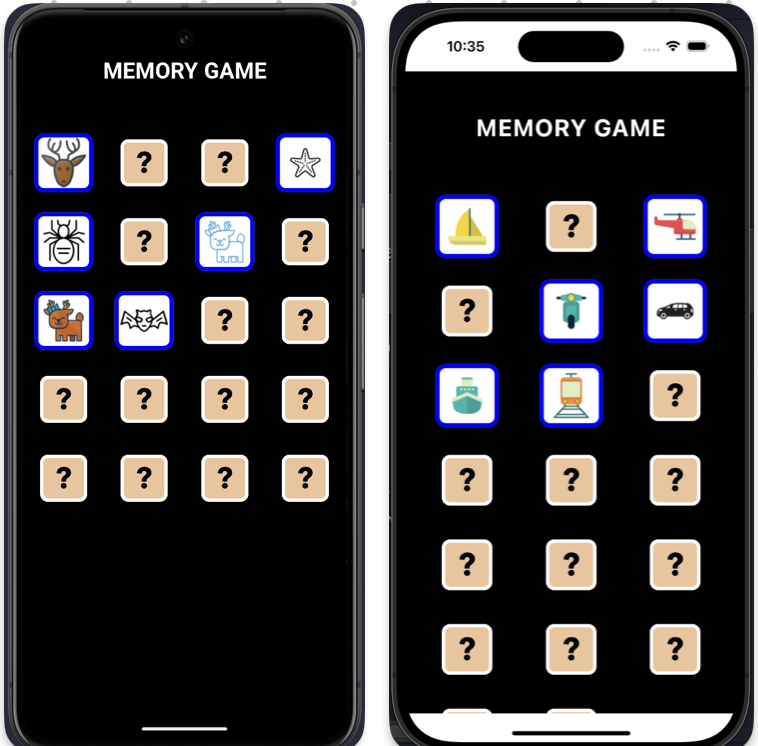

## Memory Game Portfolio App.

### `A MemoryGame`  with the purpose to display use of the following:

* #### Kotlin Multiplatform with shared UI in Jetpack Compose
* #### MVVM architecture in an intermediate project.
* #### Kotlin, Jetpack Compose and Swift/SwiftUI where it will be needed. 
* #### REST-API with Authorization. 
* #### Git structure and reflections of the work without the use of AI-generated code.
* #### Documentation in Code / README.
* #### Game logic, design and responsive UI.
* #### Unit testing when time is given.


### Progress of the game
<details>
<summary>Branches and Progress</summary><br>

##### Currently working on: `feature/load-tiles-from-start-screen`

:white_check_mark: `feature/tile-component`. Is focused on creating a component for the tile and at click, the tile
should change it's state and show the content. It will also involve an animation when changing state.

:white_check_mark: `feature/ui-board`. Will be a simple board implementing a list of tile components.
Also, since I will be using MVVM, an early structure must be formed.

:white_check_mark: `feature/icons-from-api`. This feature is fetching a response from IconFinder 
with 10 icons of a certain keyword. The request is made to a render-url using a proxy server 
for this simple purpose. The proxy server has been a side-project to the game to handle API security.
```kotlin
// Extensions in Application.
import io.ktor.server.application.*

fun main(args: Array<String>) {
    io.ktor.server.netty.EngineMain.main(args)
}

fun Application.module() {
    configureRateLimit()
    configureSerialization()
    configureHTTP()
}
````

:white_check_mark: `feature/load-tiles-from-start-screen` Since we have a JSON-response from the proxy server,
handle the response and set the tile images. The render service is using a free version with longer 
activation time, therefore, show the user a start screen loading the service and response.



:construction: `feature/compare-tiles-and-match` Compare the tiles. If they match, change
their state and appearance.

</details>